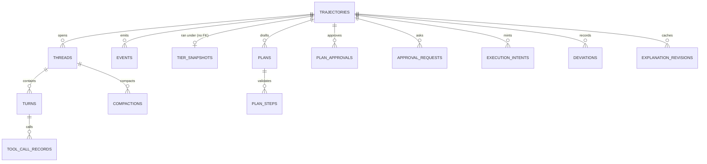

# PromptCadence — Data Model

**Database:** `promptcadence.sqlite3` (or PostgreSQL), owned exclusively by PromptCadence. One
Alembic history, including the mounted package tables.
**Conventions:** [Database Standards](../../standards/database-standards.md).
**Derived from** `infrastructure/db/models.py` and spec §10.

---

## 1. Entity overview



Every table with a `trajectory_id` cascades `ON DELETE CASCADE` from `trajectories` except
`tier_snapshots` (content-addressed, shared, deliberately no FK — an edited ceiling produces a new
row, never a migration) and `deviations.turn_id`/`tool_call_records` links, which name a turn that
may never have been answered (`tier_escalation`). Four package tables are **mounted**, not owned:
LoadLedger's (`ledger_entries`, `ledger_balances`, `ledger_balance_money`, `ledger_runs`, Phase 5)
and Commissioner's (`egress_decisions`, Phase 6) — both at module import, unconditionally, so
Alembic's autogenerate never drops them (ADR-0050). Reads and writes against both go through the
package's own class, never a `select` written in this application.

## 2. Tables

### `trajectories`
```text
id ULID PK · task TEXT · data_classification · status · project NULL
tools_json · bypass_planning · tier_override NULL · max_steps NULL · max_turns NULL
budget_money_currency NULL · budget_money_nanos BIGINT NULL · budget_token_ceiling BIGINT NULL
budget_partial_pricing NULL          -- three-valued: NULL = configured default
window_parked_from NULL · window_next_edge_at NULL · window_days_waited
tier_snapshot_id NULL                -- no FK (content-addressed, shared)
approval_policy_version NULL · halted_reason NULL · error_code NULL
lease_owner NULL · lease_expires_at NULL · cancel_requested
created_at · updated_at · completed_at NULL
content_scrubbed_at NULL             -- NULL while the retention sweep has not run
```
Indexes: `(status, created_at)`, `(status, lease_expires_at)`.

### `threads`
```text
id ULID PK · trajectory_id FK CASCADE · step_id TEXT DEFAULT 'loop' · created_at
```
One thread per step (planned path); the bypass loop's one thread carries the synthetic step id
`"loop"` — one shape in both modes. Index: `(trajectory_id)`.

### `turns`
```text
id ULID PK · thread_id FK CASCADE · trajectory_id FK CASCADE · sequence · role
tier NULL · model_provider_kind/name NULL · model_digest NULL · model_canonical_id NULL
adapter_name/digest/source_digest NULL         -- LA0: optional from birth, never retrofitted
content_text NULL · content_hash NULL · finish_reason NULL
intent_id NULL · intent_revision NULL
input_tokens · output_tokens · thinking_tokens · cache_write_tokens · cache_read_tokens NULL
loadcoach_ms NULL · overhead_ms NULL · loadcoach_job_id NULL · tool_call_id NULL
prompt_id/version/sha256 NULL        -- set only on a step-framing turn (PromptCadence's own prompt)
tool_calls_json NULL · created_at
```
Unique `(thread_id, sequence)`; index `(trajectory_id, sequence)`.

### `events`
```text
id ULID PK · trajectory_id FK CASCADE · sequence · event_type · timestamp · data_json
```
Unique `(trajectory_id, sequence)` — dense-numbered for SSE replay with `Last-Event-ID`.

### `api_tokens`
```text
id ULID PK · name · token_sha256 UNIQUE · scopes TEXT (comma-separated)
active · created_at · last_used_at NULL · revoked_at NULL · use_count
```

### `settings`
```text
key TEXT PK · value_json · updated_at
```

### `tier_snapshots`
Content-addressed: the primary key **is** the digest of the tier definitions it holds, so identical
configurations share one row and an edited ceiling produces a new one with no migration.
```text
id (digest) PK · document_json · created_at
```

### `plans`
```text
id ULID PK · trajectory_id FK CASCADE · document_sha256 · raw_document NULL   -- swept with content
validated_json · attempt · valid BOOLEAN · issues_json NULL
idempotency_key NULL · loadcoach_job_id NULL · model_canonical_id NULL
input_tokens/output_tokens/cache_write_tokens/cache_read_tokens NULL · loadcoach_ms NULL
prompt_id/version/sha256 NULL · created_at
```
One row per drafting attempt, valid or not — the corrective retry's whole history. Index:
`(trajectory_id)`.

### `plan_steps`
```text
id ULID PK · plan_id FK CASCADE · step_id · sequence · description TEXT
depends_on_json · tools_json · tier · data_classification · expected_turns
status TEXT DEFAULT 'pending' · started_at NULL · completed_at NULL · attempt
```
Unique `(plan_id, step_id)`. `status` drives the ready-set computation; `attempt` is which repeat of
the step is or last was running (ADR-0076).

### `plan_approvals`
```text
id ULID PK · trajectory_id FK CASCADE · plan_id FK CASCADE NULL
outcome · approval_policy_version · verdict_json · created_at
```
`verdict_json` holds the whole verdict, not a summary — `PLAN_REJECTED` always lists every step.
Index: `(trajectory_id)`.

### `approval_requests`
```text
id ULID PK · trajectory_id FK CASCADE · status DEFAULT 'pending' · reason
step_ids_json · expires_at · created_at · resolved_at NULL · approver_token_id NULL
kind TEXT DEFAULT 'plan'        -- plan | gated_step | bypass_gate | reapproval | ceiling_raise
detail_json NULL · resolution_reason NULL
```
`expires_at` is a stored instant, not process state — a timeout survives a restart. Index:
`(trajectory_id, status)`.

### `execution_intents`
```text
intent_id · revision  -- composite PK
trajectory_id FK CASCADE · step_id · supersedes NULL
approved_tier · fallback_tiers_json · permitted_egress_class
approved_tools_json · max_classification · token_budget
money_budget_currency/nanos NULL · budget_source · budget_sample_count · max_turns
minted_by · minted_at · approval_request_id NULL · gate_json
```
Append-only in practice (ADR-0056): a re-approval writes revision *n+1* with `supersedes = n`;
*n* is retained. Index: `(trajectory_id, step_id)`.

### `deviations`
```text
id ULID PK · trajectory_id FK CASCADE · turn_id TEXT (no FK)   -- may name an unanswered turn
intent_id · intent_revision · category · severity · disposition
reapprovable BOOLEAN · detail_json · created_at
```
Every deviation is a row, including one the policy silently continued past. Index: `(trajectory_id)`.

### `tool_call_records`
```text
id ULID PK · trajectory_id FK CASCADE · turn_id FK CASCADE · tool_turn_id NULL
invocation_id UNIQUE · tool_name · args_json NULL · args_sha256   -- args_json NULL after redaction/sweep
status · reason NULL · reason_detail NULL · result_summary NULL · result_sha256
artifact_ref NULL · output_truncated · duration_ms · risk_class · egress · isolation_tier NULL
started_at · created_at
```
A row per call including refusals and failures — "what did this trajectory try", not "what did it
manage". Indexes: `(trajectory_id)`, `(turn_id)`.

### `compactions`
```text
id ULID PK · trajectory_id FK CASCADE · thread_id FK CASCADE · step_id · tier
budget_tokens · threshold · policy_name · policy_version · plan_hash
tokens_before/after_estimate (estimates, ADR-0016) · turns_before/after · budget_unmet BOOLEAN
masked_turn_ids_json · summarized_turn_ids_json · dropped_turn_ids_json
summary_turn_id NULL · summary_intent_id NULL · summary_intent_revision NULL · created_at
```
A view, never a deletion — every original turn stays in `turns`; this is the record that the view
differed from the rows. Indexes: `(trajectory_id, created_at)`, `(thread_id)`.

### `explanation_revisions`
A derived **cache**, never the source of truth — droppable at any time with no visible effect
beyond a slower read (ADR-0093).
```text
id ULID PK · trajectory_id FK CASCADE · revision · schema_version
document_sha256 · artifact_ref          -- body lives in the artifact directory, not this table
cause TEXT · turn_count · composed_ms · superseded_at NULL · created_at
```
Unique `(trajectory_id, revision)`; index on the same pair. Revision 1 is written immediately after
the terminal transition, never inside it.

### Mounted (not owned)
`ledger_entries`, `ledger_balances`, `ledger_balance_money`, `ledger_runs` (LoadLedger, prefix
`ledger_`) and `egress_decisions` (Commissioner, prefix `egress_`) — shapes are each package's own;
see their specs.

---

## 3. Retention

| Data | Default | Notes |
|---|---|---|
| Trajectories, threads, turns, events | Forever | `content_retention_hours` sweeps text only, never the rows |
| Prompt/tool/plan **text** | Swept `content_retention_hours` after a terminal trajectory | `turns.content_text`/`tool_calls_json`, `plans.raw_document` and step descriptions, `tool_call_records.args_json`/`result_summary`/`reason_detail`, `trajectories.task`, and the workspace directory; hashes, usage, decisions and events stay. Never swept while in flight |
| Explanation revisions | Superseded ones kept until pruned | The whole table is droppable at any time (derived cache) |
| Execution intents, deviations, ledger entries, egress decisions | Forever | The explainability and audit promise depends on this |

## 4. Query-plan requirements

* Trajectory recovery scan uses `(status, lease_expires_at)`.
* Trajectory listing uses `(status, created_at)`.
* Turn/event ordering uses `(trajectory_id, sequence)`; replay never scans the whole table.
* Explanation composition reads by `trajectory_id` on each table above, in the indexes listed.
