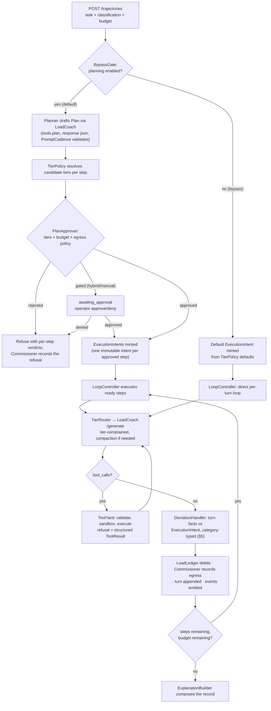
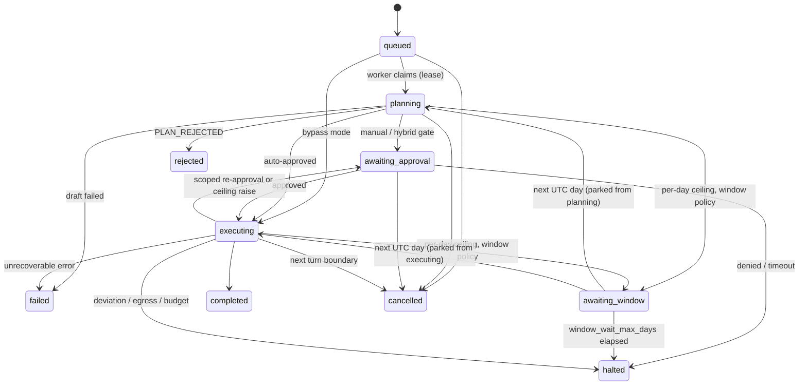

# PromptCadence — Trajectory Lifecycle, Tiers and Governance

**Owner:** PromptCadence. **Rule:** every trajectory is reconstructable, and every governance decision —
including every refusal — is persisted, not sampled.
**Also normative:** [ADR-0030](../../adr/0030-model-cost-and-pricing.md) (cost),
[ADR-0026](../../adr/0026-local-http-hardening.md) (outbound fetch),
[ADR-0044](../../adr/0044-a-state-change-and-its-event-are-one-write.md) (events),
and the PromptCadence-arc ADRs D-1…D-13 in the [PromptCadence roadmap §2](../../roadmap/promptcadence-roadmap.md).

---

## 1. The two paths



The bypass path skips exactly two boxes — `Planner` and `PlanApprover` — and nothing else. **Both
paths execute only under `ExecutionIntent`s** (§4.3); the only difference is how the intents are
minted — from an approved plan, or from `TierPolicy`'s defaults. Steps from `TierRouter` down are
byte-for-byte the same code path in both modes; the contract-1 test in [spec §18](spec.md) diffs
the two records to keep it that way.

## 2. Data classification

`baseaicore.DataClassification` is a three-level ordered vocabulary, fixed for the life of the
suite (roadmap §2, D-2):

```text
PUBLIC  <  INTERNAL  <  CONFIDENTIAL
```

* The caller declares a trajectory's classification; the default is **`confidential`** — an
  unclassified trajectory is treated as the most restrictive, never the least (fail closed).
* A tier admits a request iff `classification ≤ tier.max_data_classification`. Local tiers have an
  implicit ceiling of `confidential`; a remote tier **must** declare one at startup or PromptCadence
  refuses to start.
* Classification never travels to LoadCoach — LoadCoach has no such concept and needs none.
  PromptCadence enforces it before any HTTP request leaves, and verifies afterwards (§5) that the
  executing provider matched the tier's promise.

## 3. Tiers

A tier is configuration over LoadCoach, never routing math (roadmap §2, D-3):

```text
tier = name
     + task_profile                  # exactly one LoadCoach task profile
     + remote (bool)                 # egress class
     + max_data_classification      # required when remote
     + context_budget_tokens         # the compaction trigger input
     + pricing source               # required when remote (§6)
```

*Which model within a tier* remains LoadCoach's filter → score → rank → select, driven by the
tier's task profile: `tools.agent.local_fast` and friends are namespaced specializations of the
shipped `tools.agent` profile, carrying their own constraints (`allow_remote_providers`,
`min_context_tokens`, capability weights over `tool_use`/`agentic`/`reasoning` evidence that
FreeWeight's `native.tool_use` / `native.agent` suites already produce). Tier suitability
therefore improves when evidence improves, with no PromptCadence code involved.

Escalation between tiers follows `policy.escalation_order` and is always explicit: a step
approved for `local_fast` that fails there does not silently climb; the deviation policy (§5)
decides whether a scoped re-approval offers the next tier. It follows that the **automatic
approval policy grants no `fallback_tiers`** — an intent minted by `auto` permits exactly its
approved tier, and escalation reaches the next one through a `tier_escalation` drift and a
superseding revision. A human approver may grant fallbacks, and a supersession may add them;
granting them up front would pre-approve egress nobody asked for and make the escalation path
dead code.

**Remote tiers and LoadCoach's provider surface.** LoadCoach 1.0 configures exactly one provider.
Local tiers work against it unchanged. Serving a *mixed* candidate pool — more than one local
runtime (Ollama beside llama.cpp, once the LoRA arc lands), or local + remote — requires the
additive multi-provider registration recorded as **LC-E1**, generalized to any additional
provider, local or remote ([roadmap §5](../../roadmap/promptcadence-roadmap.md)) — the one piece
of the PromptCadence arc that touches an existing application. Until it lands, remote tiers
report `TIER_UNAVAILABLE` with the reason `loadcoach_has_no_remote_provider`; nothing else in
PromptCadence changes when it arrives.

## 4. The plan, approval, and the ExecutionIntent

### 4.1 The plan

The `Planner` calls LoadCoach under `tools.plan` asking for `response_format = "json"` and
validates the result against **PromptCadence's own** plan schema — LoadCoach never applies a caller's
schema ([ADR-0041](../../adr/0041-caller-schemas-do-not-travel-through-a-router.md)), so PromptCadence
owns validation and its bounded corrective retry (default 2), exactly as IdeaPress does.

```json
{
  "steps": [
    {"step_id": "s1", "description": "…", "depends_on": [],
     "tools": ["read_file"], "tier": "local_fast",
     "data_classification": "internal",
     "expected_turns": 2}
  ]
}
```

Rules, each enforced by validation rather than convention:

* `depends_on` must form a DAG; a cycle is `PLAN_INVALID`.
* A step's declared classification may not exceed the trajectory's — a plan cannot launder
  confidential data into an `internal` step.
* Declared tools must exist in the trajectory's allowlist; declared tiers must be configured.
* An empty plan is invalid — emptiness cannot pass a gate (the IdeaPress M7 lesson).
* The plan is persisted verbatim alongside its validated form; `expected_turns` and the step
  descriptions are advisory (they inform estimates), while tools, tier and classification are
  **declarations** that approval turns into the step's `ExecutionIntent` (§4.3) — the envelope
  the execution is then held to.

### 4.2 Approval

`PlanApprover` renders one verdict per step — `approved`, `redlined` (a forced substitution, e.g.
"remote_cheap → local_large, classification ceiling", with the original preserved) or `rejected` —
plus a trajectory-level verdict. Its inputs are the tier policy, the ledger's headroom (§6) and
the egress policy; its output is deterministic given those inputs, and versioned
(`approval_policy_version` on every trajectory).

`approval_policy_version` is **derived, never declared**: it is a digest over the configured
policy values *and* a digest of the approver's own decisions over a fixed corpus, the second
asserted by a test that fails with the new value whenever a rule changes. A version an
implementer must remember to bump is a version that will not be bumped, and a stale one silently
reinterprets every trajectory already recorded under it. The other half of pinning a decision is
the trajectory's tier snapshot (§3), which fixes what the tiers were.

**Approval modes** (roadmap §2, D-5): `auto` applies the policy verdict directly. `manual` holds
every plan in `awaiting_approval` for an `approve`-scoped operator. `hybrid` auto-approves except
steps matching the configured gates (egress at/above `gate_egress_at`, estimated step cost above
`gate_step_cost`) — those pause the trajectory at the point the gated step becomes ready, so
ungated early steps may run first. In bypass mode the same gates fire too — at the minting of the
default intent (§4.3) and at every re-mint a drift triggers, since a gate is evaluated at minting:
bypass removes planning, never approval of gated egress. A pending request expires after
`approval.request_timeout_hours` and halts the trajectory with the timeout recorded.

### 4.3 The ExecutionIntent — the approved envelope every turn checks against

The plan declares; approval decides; but execution and deviation happen at **turn** granularity.
The object that bridges the gap is the `ExecutionIntent` (roadmap §2, D-12): **approval's output
is not a verdict on a document — it is the minting of one immutable intent per approved step**,
and every turn executes under exactly one intent and is checked against exactly that intent.

```text
ExecutionIntent
  intent_id · trajectory_id · step_id        # step_id is the synthetic "loop" in bypass mode
  revision · supersedes                      # re-approval mints revision n+1; nothing is edited
  approved_tier + fallback_tiers             # ordered; may be empty. Gates are evaluated at
                                             # minting against the MOST permissive tier in the
                                             # set, so a pre-approved fallback cannot smuggle
                                             # egress past a hybrid gate
  approved_tools                             # frozen subset of the trajectory allowlist
  max_classification                         # ≤ the trajectory's declaration
  token_budget · money_budget                # the step's slice, with the estimate source (§6)
  max_turns                                  # tool round trips this intent covers
  minted_by                                  # "policy" | approver token identity | "bypass_default"
  minted_at · approval_request_id            # the human grant, when one gated it
```

Rules, each load-bearing:

* **Immutable.** A redline is resolved *at minting* (the intent carries the substituted tier, the
  plan retains the original); a scoped re-approval **supersedes** the intent with a new revision
  rather than editing it, and the superseded revision is retained — the audit trail holds every
  envelope a turn ever ran under.
* **Universal.** The bypass path mints one default intent from `TierPolicy`'s defaults
  (`policy.default_tier`, the trajectory allowlist, the trajectory's classification and budget,
  `execution.max_steps` as `max_turns`) before its first turn. Governance invariance
  ([spec §11](spec.md) contract 1) is therefore structural, not procedural: there is no code path
  that executes a turn without an intent to check it against.
* **The single comparison source.** `DeviationHandler` is a pure function
  `compare(turn_facts, intent) → deviations` — no "plan-declared vs default-policy" branching,
  which is what collapses the state-machine complexity the two-source design carried.
* **Turns record their envelope.** Every turn persists `(intent_id, revision)`; the explanation
  shows which envelope each turn ran under and why a new revision appeared.
* Minting emits `intent.minted`, in the same write as the transition that caused it
  ([ADR-0044](../../adr/0044-a-state-change-and-its-event-are-one-write.md)).

## 5. Deviation handling

After every turn the `DeviationHandler` runs one pure comparison —
`compare(turn_facts, intent) → deviations` — against the turn's `ExecutionIntent` (§4.3),
identically in both paths.

`turn_facts` is a frozen value object built from the LoadCoach response (and from the ledger's
per-step running totals) by the executor, never by the handler, and it carries **exactly** the
facts an intent field can be contradicted by:

```text
TurnFacts
  turn_id
  executed_tier                       # None when the intent's tiers could not serve
  subject                             # model identity, provider kind, and the VERIFIED egress
                                      # class of what actually answered (§11 contract 4)
  tier_service_failure                # no_eligible_model | tier_unavailable; set iff no tier served
  requested_tools                     # what the model asked for this turn
  trajectory_allowlist                # the caller's allowlist, which splits `undeclared_tool`
  observed_classification             # the classification of what came back
  turns_used                          # turns under this intent, including this one
  step_tokens_spent · step_money_spent · step_money_is_floor
  finish_declared                     # a declared finish_reason, never the text saying it is done
```

The closure argument has two halves, and this is the second: the taxonomy is closed because there
is one category per intent field, which only holds if `turn_facts` can express no fact that no
intent field covers. In particular it carries **no trajectory-level ceiling, balance or
headroom** — a ceiling crossing is the budget machinery's halt or park (§6), and a fact of that
kind reaching `compare()` would either be ignored or demand a seventh category. Deviations are **category-typed**: there is exactly one category per
intent field it can contradict, plus one for a promise contradicted after the fact, so the
taxonomy is closed by construction — a new intent field is what it takes to create a new category.

Two severities exist and are not configurable:

* **`violation`** — the executed reality contradicted an already-made promise. Unconditional
  halt, never re-approvable, recorded as a `VIOLATION` `EgressDecision` where egress-relevant.
* **`drift`** — the model or the environment wants something the intent does not cover. The
  disposition follows `reapproval_scope`.

| Category | Intent field | Trigger | Severity | `on_tier_or_classification_change` (default) | `any_deviation` |
|---|---|---|---|---|---|
| `tier_violation` | `approved_tier` + `fallback_tiers` | The response's execution subject (model, provider — named on every LoadCoach response, verified not assumed) is remote where every approved tier is local, or is a tier outside the intent entirely | violation | **Halt** + `VIOLATION` `EgressDecision` | Same |
| `tier_escalation` | `approved_tier` + `fallback_tiers` | The approved tiers cannot serve the step (`NO_ELIGIBLE_MODEL`, tier unavailable) and the next tier in `escalation_order` is outside the intent | drift | Scoped re-approval (may mint a revision carrying the next tier) | Same |
| `classification_exceeded` | `max_classification` | A tool result introduces data above the intent's ceiling (operator-flagged paths) | drift | Scoped re-approval | Same |
| `undeclared_tool` | `approved_tools` | The model requests a tool outside the intent. Outside the *trajectory allowlist* as well: the call is refused outright (structured `ToolResult`) and recorded — never re-approvable, because the allowlist is the caller's, not the model's | drift | Inside the trajectory allowlist: continue, recorded | Scoped re-approval even for allowlisted tools |
| `budget_overrun` | `token_budget` / `money_budget` | The step's actual spend exceeds its intent budget (estimate × 2) | drift | Continue while trajectory ceilings hold, recorded | Scoped re-approval |
| `turn_overrun` | `max_turns` | The step reaches `max_turns` without a declared finish | drift | Scoped re-approval (a revision may extend `max_turns`) | Same |

Trajectory-level ceiling crossings are **not** deviations — they are the budget machinery's own
halt/pause (§6); a deviation is always a statement about one turn against one intent.

Scoped re-approval re-runs `PlanApprover` over **the drifted step only** — the practical-cost
default the skeleton argued for — and its grant is the minting of a superseding intent revision
(§4.3), through the same approval modes (a hybrid gate can turn it into a human question). A
denial halts; more than `3` deviations on one step halts with `DEVIATION_HALTED`. Every deviation,
including silently-continued drifts, is an event (`deviation.detected`, carrying the category) and
a row.

## 6. Budget: two ceilings, labelled estimates

Money is governed by [ADR-0030](../../adr/0030-model-cost-and-pricing.md), which forces the design
the skeleton's `Money | Unsupported` hinted at: **a local model's cost is `UNSUPPORTED`, never
$0.00**, so a money ceiling alone cannot govern local execution. LoadLedger therefore accumulates
both:

* **Token ceiling** — binds every turn on every tier. The universal brake.
* **Money ceiling** — binds priced usage. Every remote tier must name a pricing source
  (`ModelPricing` records with provenance); a remote tier without one is refused at approval time
  with `UNPRICED_EGRESS_REFUSED`. Unpriced egress is refused, not free — a ceiling cannot bind
  what cannot be priced, and "free" is exactly the fabricated zero ADR-0016 forbids.

A priced response the provider did not fully report — the ordinary case for an adapter that
leaves the cache classes unreported — accumulates the components that were priced as a **floor**,
and every verdict over that window carries the counts that make it one
([ADR-0069](../../adr/0069-a-partial-price-is-a-floor-and-a-money-ceiling-chooses-how-it-binds.md)).
On a floor, "exceeded" is certain and "under budget" is not, so the brake can fire late by the
unreported portion. `[budget] partial_pricing = "strict"` reverses that for a hard budget: a
response that could not be fully priced exceeds the money ceiling, at pre-flight too, and the cap
is never crossed. Either way the UI renders a floor as "at least", never as a bare figure.

Debits store `TokenUsage` + `pricing_hash`, never a money figure as the primary fact; scopes
(`per-trajectory`, `per-day` UTC, `per-tag` — the project) may be active simultaneously and the
most restrictive binds, with every entry recording its balance after against each active ceiling
([LoadLedger §7](../../packages/loadledger/spec.md)). Every debit is tagged with its tier too,
for the estimator and the ledger views; **no tier ceiling is configured, so a tier has a balance
and not headroom** — the ledger views report what it has *spent*, and nothing about a tier can be
exceeded because nothing caps it. That balance is read, never computed here:
`loadledger 0.2.0`'s `balances(scope, window_key)` answers a window with no ceiling over it, so
the view asks the ledger rather than summing entries in this application (which ADR-0050's mount
exists to prevent) or configuring an unreachable cap purely to read a number through (which would
put a magic figure in the record). Until that release the same views reported a debit **count**,
which is what the read replaced.

**A money ceiling binds a step only when that step's usage is priced** (ADR-0047 §3, "money
ceilings bind priced usage"). LoadLedger evaluates every ceiling and reports every verdict; which
of them *refuses the next step* is the application's policy, and a money cap exhausted by
somebody's priced work does not stop a local step that cannot add a nano to it. The token ceiling
is the universal brake and binds every step on every tier, which is exactly why there are two.
A *balance report* — what `GET /ledger` shows — makes no such distinction: it says what the
ceilings say, not what one particular step may do.

Three ceilings are active on a labelled trajectory: its own (the request's `budget` or the
configured default, `per-trajectory`), the `per-day` ceiling every trajectory shares, and its
project's (`per-tag` on `project:<name>`, a lifetime cap that never resets — the shape a project
budget should have). A `project` on the request must name a configured `[budget.projects.<name>]`
or the request is refused with `PROJECT_UNKNOWN`; every debit then carries the project tag beside
its tier tag. Exhaustion is handled per ceiling: a per-trajectory or per-project ceiling halts or
asks for a raise (`on_exhausted`), because waiting would not help; the per-day ceiling may instead
park the trajectory in `awaiting_window` until the next UTC day (`on_daily_exhausted = "window"`,
§8), which is what lets any amount of work run while only so much is spent in a day.

A trajectory parked in `awaiting_window` is released by asking the pre-flight's question — *does
the per-day ceiling now admit the next step* — and not the cheaper *is the ceiling exceeded*. A day
whose remaining headroom is smaller than the next step's estimate still refuses, and waking a
trajectory only for its next pre-flight to park it again would spend a day edge per day, forever,
with an event stream to match.

**Pre-execution step estimates** (the skeleton's open question, resolved as roadmap §2, D-3) use a
layered estimator whose source is always recorded, mirroring the suite's served-context labelling:

```text
estimate = p80 of observed cost for (tier, task_profile)   when ≥ estimate_min_samples exist
                                                            → source "historical"
           configured per-tier default                      otherwise
                                                            → source "configured_default"
```

The estimate is over observed **usage**, and the money it implies is derived by pricing that usage
through the tier's own price records — the same operation, against the same record, that costs a
real turn (ADR-0030 rule 1: a ledger entry stores usage and a pricing hash, and no money figure to
average). The p80 is taken per token class rather than over one total, because the classes price
differently. A pre-flight has no model identity to price against, since which model answers is
LoadCoach's choice and is not known until it has answered, so an estimate is costed against every
record the tier still claims and the **largest** total wins ([ADR-0072](../../adr/0072-the-model-pricing-record-file.md) §6): the only estimate that cannot
under-state a budget is the tier's worst case, and under-stating is the failure that matters.

A model-generated cost guess is never an estimator input — a number the model invented must not
size the budget that constrains the model. `PlanApprover` approves a plan only if the sum of step
estimates fits the remaining ceilings; the estimate, its source and the samples behind it appear
in the approval record.

## 7. Context compaction

Before each turn the `TierRouter` estimates the transcript against the tier's
`context_budget_tokens`. Above `compaction.threshold` (default 0.8) it asks CutCtx for a
`CompactionPlan` over the configured policy chain — observation masking first, then summarization,
then drop-oldest — with the system turn and the `protected_recent_turns` never touched, and a
tool call never separated from its result ([CutCtx §11](../../packages/cutctx/spec.md)).

CutCtx is pure: when the plan contains a `SummarizationRequest`, **PromptCadence** executes it via
LoadCoach (`general.summarize`, on the trajectory's cheapest admissible *local* tier — a summary
of confidential turns must not itself become egress) and hands the summary back to the executor.
Compaction is a view, never a deletion: the store keeps every original turn; what changes is the
`ThreadSnapshot` sent to the model. Every compaction emits `context.compacted` with before/after
token estimates and the turns affected, and the summarization call is itself a turn — debited,
recorded, explainable.

## 8. Scheduling and the state machine



### 8.1 States

| State | Meaning | Lease | Live intent required | Terminal |
|---|---|---|---|---|
| `queued` | Accepted and persisted; no worker has claimed it | no | no | no |
| `planning` | A worker holds the lease; drafting, validating and evaluating approval | yes | no | no |
| `awaiting_approval` | Parked on exactly one pending `approval_request` (plan-level, gated step, scoped re-approval, or ceiling raise); its timeout clock is persisted | no | no | no |
| `awaiting_window` | Parked on an exhausted per-day ceiling under the `window` policy; the state it parked from, the next UTC-day edge and the days waited are persisted | no | no | no |
| `executing` | A worker holds the lease; every dispatched step has a live (non-superseded) `ExecutionIntent` | yes | yes | no |
| `completed` | Every step reached declared success (or the bypass loop declared finish) | no | — | **yes** |
| `rejected` | The trajectory-level plan verdict was `rejected`; nothing executed | no | — | **yes** |
| `halted` | Stopped by governance: violation, denial, deviation limit, budget exhaustion, approval timeout — the cause is on the row | no | — | **yes** |
| `failed` | Stopped by an unrecoverable error (the cause is on the row) | no | — | **yes** |
| `cancelled` | Stopped by the caller | no | — | **yes** |

### 8.2 Transitions

Every transition commits with its event in one write
([ADR-0044](../../adr/0044-a-state-change-and-its-event-are-one-write.md)). No transition exists
that this table does not list; terminal states have no outgoing rows.

| # | From | To | Trigger | Guard | Event(s) in the same write |
|---|---|---|---|---|---|
| T1 | — | `queued` | `POST /trajectories` | Request validates (classification, tools ⊆ registry, caps) | `trajectory.created` |
| T2 | `queued` | `planning` | Worker claim | Planning enabled for this trajectory; lease acquired | `trajectory.claimed` |
| T3 | `queued` | `executing` | Worker claim, bypass | Bypass permitted; lease acquired; default intent minted | `trajectory.claimed` + `intent.minted` |
| T4 | `planning` | `executing` | Auto approval | Every step approved/redlined; intents minted | `plan.approved` + `intent.minted` × n |
| T5 | `planning` | `awaiting_approval` | Manual mode, or a hybrid-gated step with no ungated work ready | `approval_request` created | `approval.requested` |
| T6 | `planning` | `rejected` | Trajectory-level verdict rejected | — | `plan.rejected` |
| T7 | `planning` | `failed` | Plan draft failed after the corrective budget | — | `trajectory.failed` |
| T8 | `awaiting_approval` | `executing` | Operator/API approve | `approve` scope; request pending; intents (re-)minted | `approval.granted` + `intent.minted` |
| T9 | `awaiting_approval` | `halted` | Deny, or `request_timeout_hours` elapsed | — | `approval.denied` (or timeout) + `trajectory.halted` |
| T10 | `executing` | `awaiting_approval` | A hybrid-gated step becomes ready; a drift needs scoped re-approval; a ceiling raise is requested | `approval_request` created; in-flight turns finish first | `approval.requested` |
| T11 | `executing` | `completed` | All steps terminal-success / declared finish | — | `trajectory.completed` |
| T12 | `executing` | `halted` | `tier_violation`; re-approval denied; deviation limit; budget exhaustion (halt policy); egress denial with no permitted tier | Cause recorded | `trajectory.halted` |
| T13 | `executing` | `failed` | Unrecoverable error | Cause recorded | `trajectory.failed` |
| T14 | any non-terminal | `cancelled` | `POST /cancel` or CLI | From `executing`: honoured at the next turn boundary; any in-flight LoadCoach job cancelled | `trajectory.cancelled` |
| T15 | `planning` or `executing` | `awaiting_window` | The per-day ceiling would be exceeded by the plan or by the next step, and `on_daily_exhausted = "window"` | Parked-from state and the next UTC-day edge persisted; in-flight turns finish first; lease released | `budget.window_wait` |
| T16 | `awaiting_window` | the state it parked from | The UTC day rolls | The per-day ceiling now admits the plan or step; `window_wait_max_days` not exceeded; lease re-acquired | `trajectory.resumed` |
| T17 | `awaiting_window` | `halted` | `window_wait_max_days` elapsed — the ceiling still refused at that many day edges | Cause recorded | `trajectory.halted` |

Turn-loop activity inside `executing` (turns, tool calls, debits, egress verdicts, compactions)
emits its own events but is not a state transition; `executing` is one state, not many.

### 8.3 Recovery edges

Per [ADR-0036](../../adr/0036-queue-recovery-transitions.md), every lease-holding state has an
explicit recovery edge, exercised at startup and on lease expiry:

| Lease-holding state | Recovery |
|---|---|
| `planning` | Re-claim; cancel any in-flight LoadCoach plan job; discard the partial draft and redraft (drafting has no side effects to reconcile). Emits `trajectory.recovered` |
| `executing` | Re-claim; reconcile the in-flight turn: committed → resume at the next ready step; uncommitted with a known LoadCoach job → cancel the job, re-derive any missing debit from the persisted turn (idempotent by `source_ref`), resume; unreconcilable → `halted` with `recovered_after_crash`. Emits `trajectory.recovered` (or `trajectory.halted`) |

`queued`, `awaiting_approval` and `awaiting_window` hold no lease and need no recovery; their
clocks (ageing, approval timeout, the window edge and its day count) are persisted values, not
process state.

**How "a known LoadCoach job" is known** (Phase 3). Before every `/generate` call the loop writes
`turn.started` in its own transaction, carrying the `turn_id`, and sends that id as the request's
`idempotency_key` under `X-Client-Name: promptcadence`. A `turn.started` with no turn row is
therefore the in-flight work at the crash, and its key is enough to find the job with LoadCoach's
own API and nothing else: `GET /jobs?source=promptcadence` lists this application's jobs with
their keys. An in-flight job is cancelled (`POST /jobs/{id}/cancel`) and the trajectory resumed
with a fresh turn; a completed one is reconciled into the turn row from its job document and the
loop continues from what it decided; a key no job holds is the unreconcilable edge. The loop
never re-POSTs `/generate` with the old key to find out, because after
`queue.idempotency_ttl_hours` a re-POST would start *new* work and `/generate` cannot tell a
replay from a fresh execution. Startup takes over every lease not held by this process — the
single-process design makes any other owner a process that is gone — and the running reaper takes
over only expired ones. An unreachable LoadCoach defers the reconciliation to the next pass rather
than halting on a transient outage. **How a planning job is known** (Phase 7): every planning
call carries an idempotency key of the form `plan:<trajectory_id>:<drafting session>:<attempt>`,
so a `planning` lease found at recovery lists this application's non-terminal jobs, cancels every
one under the trajectory's prefix, and redrafts under a fresh session nonce — a redraft never
re-POSTs the crashed session's key, because a replayed key would return the cancelled job's
document rather than a draft. Every attempt, valid or not, is already a `plans` row with its
`plan.drafted` event, so nothing drafted before the crash is lost to the record.

### 8.4 DAG dispatch

**DAG dispatch** (the skeleton's scheduling question, resolved): the `LoopController` maintains a
ready set (steps whose dependencies committed) and dispatches with `max_concurrent_steps = 1` by
default. Raised, concurrency is granted only across **disjoint execution surfaces**: at most one
local step in flight ever — LoadCoach's admission control and
[ADR-0038](../../adr/0038-one-model-at-a-time-per-gpu.md) make two concurrent local steps a
queueing fiction — plus up to `max_concurrent_remote_steps` remote steps. The plan's DAG is always
recorded even when execution is serial, so the explanation shows what *could* have run in
parallel.

## 9. The explanation

`ExplanationBuilder` composes, in turn order: the request, the plan and its verdicts (when
planned), every `ExecutionIntent` with its revisions, every turn with its tier, intent reference,
model identity, `TokenUsage`, timings and the LoadCoach `decision_id` whose full routing
explanation LoadCoach retains; every `ToolCallRecord`; every `LedgerEntry` with balances; every
`EgressDecision`; every deviation and approval; every compaction. Exported as the
application-owned document `promptcadence.trajectory_explanation` `1.0`
([ADR-0035](../../adr/0035-application-owned-document-schemas.md)), golden-tested, rendered in the
UI as a readable timeline with the numbers behind every figure.

### 9.1 Materialized explanation revisions

Retention is forever by default, across seven tables — so on a long-lived deployment the dominant
read becomes "explain trajectory X", and composing it live is a multi-table reconstruction that
grows linearly with trajectory complexity, re-paid on every read. The composed document is
therefore **materialized** (roadmap §2, D-13):

* When a trajectory reaches a **terminal state**, the same transaction's follow-up work composes
  the document once and persists it as `explanation_revisions` revision 1 — the document body in
  the artifact directory with its hash on the row, per the suite's large-payload rule. A terminal
  trajectory is immutable, so its explanation is write-once and every later read is one row plus
  one artifact fetch, independent of turn count.
* Reads of an **in-flight** trajectory compose live — an active trajectory is short relative to
  the archive, and a snapshot of a moving record would be stale by the time it returned.
* **The rows stay authoritative; the revision is a derived cache** — the same discipline as
  ADR-0030's "store usage, derive cost". Anything that changes the underlying rows invalidates
  the current revision and materializes the next one, recording why: the retention sweep
  (content scrubbed → revision n+1 with "content removed by retention" stubs), a ledger
  re-costing under a corrected price record, or a document-schema minor bump on upgrade. A
  revision is never edited; superseded revisions keep their artifacts until the operator prunes
  them.
* An equality golden asserts `materialize(rows) == compose_live(rows)` for every fixture
  trajectory — the cache can be dropped and rebuilt from the rows at any time, and `promptcadence
  db` gains a `rebuild-explanations` maintenance command for exactly that.

## 10. Determinism and testability

Given the same configuration, tier snapshot, ledger state, policy versions and scripted LoadCoach
and tool responses, a trajectory produces the same decisions, the same record and the same
explanation. Planning itself is a model call and is not deterministic — but everything that judges
the plan is: approval, intent minting, tier resolution, estimation, the deviation comparison
(`compare(turn_facts, intent)`) and compaction planning are pure functions over injected inputs,
golden-tested, exactly as LoadCoach's routing is.
